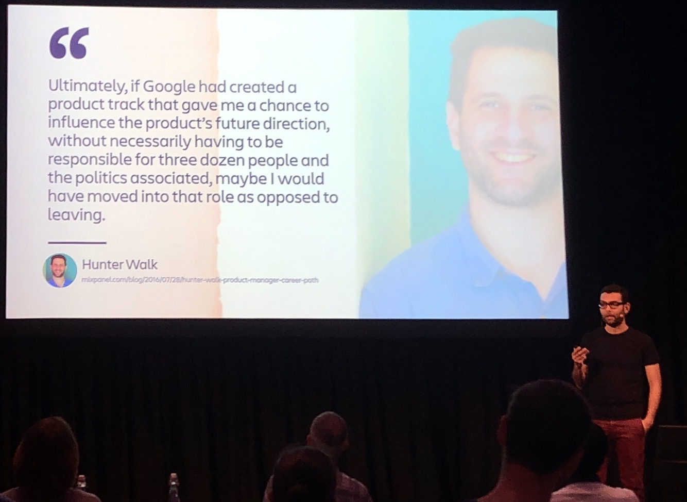

# Lessons as a Developer from Web Directions Product

In the beginning of August 2019 I attended the Product focused Web Directions conference with Myles, another Cogent engineer. Here are my take aways from two days I found very valuable as a developer, gaining different insights than I would usually find at an engineering-focused conference. I expect I’ll go to many more product focused events in the future.

David Demaree, Product Manager of Google’s Material Design, gave a fantastic opening keynote. He focused on how to define what does a product manager do, and the attributes that you can measure a product manager by.

These attributes are: Strategy, Execution, Storytelling, Domain Knowledge, and Leadership. Each person can be measured for each of these traits, and will make up what David described as a product manager. These can plotted within a pentagon like below, with a number of examples demonstrating strengths and weaknesses across a range of hypothetical product managers.

David also went into the importance of narrative, as a way to create understanding between the team and the product, and between users and the product. They use storytelling to allow users to understand how the product relates to them. These user stories are brought to the team further deepen their understanding of not just what they are building, but for who and why. The team also needs something concrete and actionable. A specific solution for a specific problem for a specific user market.

Your metrics should not just be numbers, but be associated with a narrative to provide meaning to the changes in those numbers.

These perhaps might not be novel ideas, but for me it was a compelling framing. A system that makes intuitive sense. David used to be an engineer at Typekit, and this talk got me excited that perhaps there could be product management or aspects in my future. He mentioned a quote from Leland Rechis @leland, a product manager at Google — “Product managers take in a firehose of information and output it as structure”. Sounds like what we often do in software engineering.

----

Anna Harrison from Thnx talked about ‘Hum’ within teams. It’s a concept that sounds a bit odd at first, but through this talk I am convinced that this is something I have observed and experienced in teams. Similar concepts are team culture, cohesion, collaboration, communication. She argues you can’t just scale Hum. Teams prefer to be somewhere on the scale from Chaos to Order. So keep them where they prefer: when projects change and mature, keep teams together and where they work best. Don’t thoughtless break teams up as the Hum can break too — it takes roughly six months to grow trust within a team. So all managers should be mindful of this effect.

----

Nicole Brolan, Chief Product Officer at Seek, gave really great concrete stories of projects and how they had failed or how their team had to tried to avoid failure. Often their attempts to bet on the right horse ends up backfiring. Teams want to act decisively, but by doing so can become so emotionally invested that they arrive at the wrong solution. So Nicole suggested casting a wider net with techniques to avoid confirmation bias.

----

There were quite a few great quotes from various talks:

- “It takes 7 minutes for the mood of a leader to infect the team” — Michelle McQuad, MAPP
- “Out of the crooked timber of humanity, no straight thing was ever made” — Immanuel Kant
- The IKEA effect — people place a disproportionately high value on products they partially create.

----

Day two began with yet another note with Sherif Mansour, a Distinguished Product Manager at Atlassian. His unusual job title was explained in the talk, as Atlassian offers two paths for senior staff: either they can go into management within their area (design, development, product management) or they further specialise in their area as an individual contributor without the management side.

This addressed to common problem of people going into management who were not suited or not interested in management because they had no other way to climb the ladder.

Sherif encouraged common product management tasks such as customer interviews, personas, story mapping, surveys, data analysis to always be done with other members of the team and never alone by the manager. This meant the learning was shared instead of having to be re-communicated back to the team, and the team was far more involved in the understanding of who the product was for and why it mattered to them.

Build-a-Box was a way to involve, yes, storytelling again and a way for teams to get more involved. People would use pens and paper to draw what the product would say and look like if it were sold on the shelf in a cardboard box. It can work for both the entire product and a particular feature.

On the topic of planning for the next ten years of your career, Sherif encouraged us to write down the activities we want to be doing in ten years instead of what title we want in ten years. Again this resonated with me, as I have not always felt content with being put into a ‘developer’ or ‘programmer‘ box, and if I want to draw wireframes or do user research it seems I must move into the ‘designer’ or ‘product manager’ box. Perhaps in ten years, today’s usual roles will have shifted significantly with new ones formed.

Helping with this multi-angled view is the Product Manager Craft Triangle, which plots people within the three axis of general manager, artist, and scientist. Sherif said practically no-one sits at dead centre, but rather people tend toward one or two of these traits. I plotted myself near the artist corner, looking at management as a skill I want to grow in, and scientist as something that has never really captured my attention.