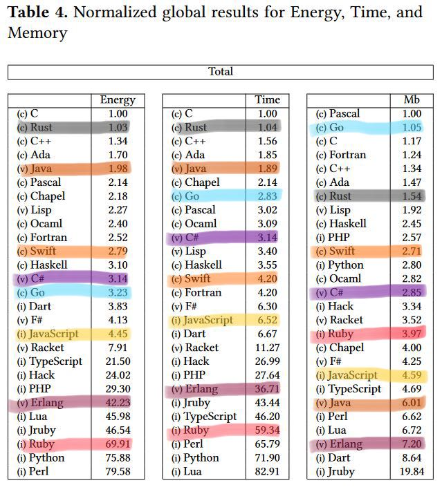

# Programming language ⚡️ energy efficiency compared

A team of Portuguese researchers have compared 27 programming languages by their energy use. They compared both CPU and DRAM energy usage with total time of execution and memory usage to build a fuller picture of efficiency.

Unsurprisingly compiled languages such as C and C++ perform best or near the top. Their modern successor Rust also does well.

Golang uses more CPU, but is still relatively lean. It’s especially impressive with memory usage, using even less than C or C++.

Swift and C# are not standouts, but both do very well both with energy and memory use. This contrasts with Java, which is faster and uses less energy, but has over twice the memory usage of these two.

JavaScript is one of the fastest interpreted language, having had over a decade of focused performance improvements. I have to assume they tested with NodeJS — I think server-side JavaScript has many interesting futures outside of this one particular tool.

Ruby and Erlang are both at the high end for energy use and CPU time. This could be because many of what were benchmarked were computationally intensive algorithms, which if you are building web applications you may not be writing many of yourself. However, many of the underlying libraries may still exhibit this sort of performance and energy profile.

All in all, I think it’s an interesting comparison, and I think it’s great to be putting a focus on energy usage as an important metric — it is something to be mindful of for both code running on servers in the cloud, and code on users devices.

You can read [the full paper](http://greenlab.di.uminho.pt/wp-content/uploads/2017/10/sleFinal.pdf), and there’s also [more analysis to read](https://thenewstack.io/which-programming-languages-use-the-least-electricity).
