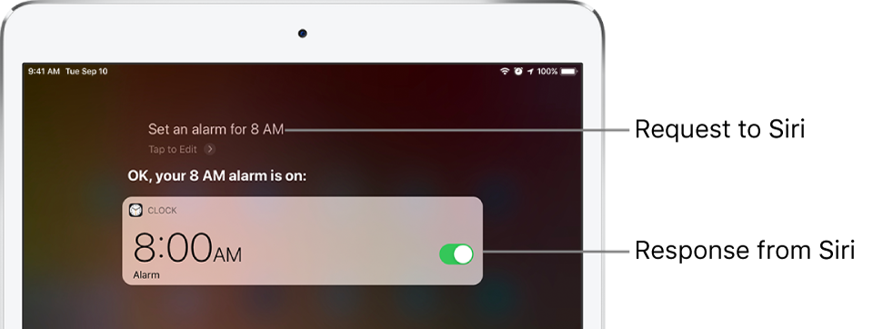
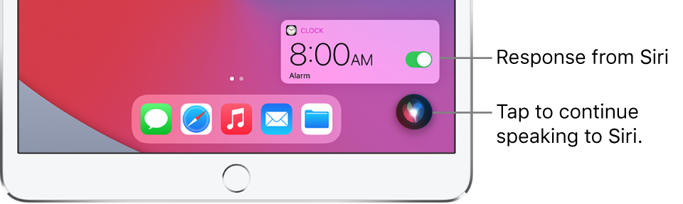
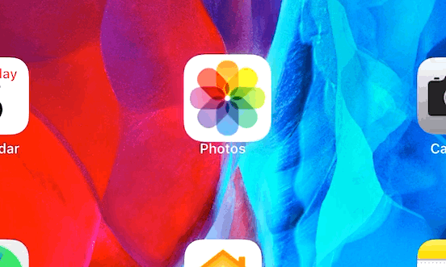

# The Apple Experience Augmented — Part 1: User Experience

I want to cover what the user experience of an AR Glasses product from Apple could look like, and how it might integrate with today’s products. First, let’s survey Apple’s current devices and their technologies for input & output:

## iPhone input methods

*   **Multitouch:** use your fingers naturally for **UI interactions, typing text, drawing, scrolling**
*   **Voice:** request **commands** from Siri such as change **volume** or **app-switching**, dictate instead of **typing**

## iPad input methods

*   **Multitouch:** use your fingers naturally for **UI interactions, typing text, scrolling, drawing**
*   **External Keyboard:** faster and more precise **typing** than multitouch
*   **Pencil:** finer control than multitouch, especially for **drawing**
*   **Trackpad:** finer control than multitouch, especially for **UI interactions**
*   **Voice:** request **commands** from Siri such as changing ****volume**** or ****app-switching**, dictating text**

## Mac input methods

*   **Keyboard:** dedicated for **typing text**, also running **commands**
*   **Trackpad / Mouse:** move and click pointer for **UI interactions, **scrolling****, **drawing**
*   **Function keys:** change device preferences such as **volume**, screen/keyboard **brightness**; **app-switching**
*   **Touchbar:** change **volume**, screen/keyboard **brightness**; enhances current app with quick controls
*   **Voice:** request **commands** from Siri such as changing ******volume****** or ******app-switching****, dictating text**

## Apple Watch input methods

*   **Touch:** use your fingers for **UI interactions,** awkward **typing text, scrolling**
*   **Digital Crown:** change **volume,** **scrolling, navigate back**
*   **Voice:** request **commands** from Siri such as changing ******volume****** or ******app-switching****, dictating text**

## AirPods input methods

*   **Voice:** request **commands** from Siri such as changing **volume, dictating text**
*   **Tap:** once to **play/pause**, double to skip **forward**, triple to skip **backward**

So what would a [rumoured](https://www.macrumors.com/roundup/apple-glasses/) Apple Glasses product bring?

## Apple’s Design Principles

### Deference to Content

The most sparse approach might be to rely on voice for all input. Siri would become a central part of the experience, and be the primary way for switching apps and changing volume and dictating text. Siri currently can be activated from multiple devices, such as personal hand-held devices such as iPhone or shared devices such as HomePod. So it makes sense that the glasses would augment this experience, providing visual feedback that accompanies the current audible feedback.

Contrast Siri’s visual behaviour between iPadOS 13 and 14:

Siri [in iPadOS 13](https://support.apple.com/en-au/guide/ipad/ipad4bce70ef/13.0/ipados/13.0) takes over the entire screen

Siri [in iPadOS 14](https://support.apple.com/en-au/guide/ipad/ipad4bce70ef/14.0/ipados/14.0) layers discretely over your screen with a compact design

This provides a glimpse of the philosophy of the Apple Glasses. Instead of completely taking over what the user current sees, Siri will _augment_ what you are currently doing with a discrete compact design.

This also relates to the _Defer to Content_ design principle that has been [present since iOS 7](https://www.slideshare.net/dtireli/ios-human-interface-guidelines) which was the opening statement from Apple’s current design leadership. So we can imagine a similar experience with the Glasses, but where the _content_ is everything the user sees, whether that’s digital or physical.

Content from a traditional app could be enhanced via augmentation. A photo or video in a social media feed might take over the user’s view, similar to going into full screen. Text might automatically scroll or be spoken aloud to the user. Content might take over briefly, and then be easily dismissed to allow the user to get back to their life.

Widgets such as weather or notifications such as received messages might be brought in from the outside to the centre. I can imagine a priority system from the viewer’s central vision to the extremes of their [field-of-view](https://en.wikipedia.org/wiki/Field_of_view)). Content could be pinned to the periphery and be glanced at, while periodically in the background it receives updates.

If worn together with a set of AirPods, an even more immersive experience would be provided, with the AirPod’s tap input for playing and skipping. The _active noise cancellation_ mode would probably pair well with a similar mode for the glasses, blocking the outside world for maximum immersion. Its counterpart _transparency_ mode would allow the user to reduce the audible and visual augmentation to a minimum.

### Clarity

So with a Glasses product, what is the content? It’s the world around you. But what if the world sometimes is an iPhone or Mac you use regularly through your day? Do the Glasses visually augment that experience?

With AirPods you can hop from an iPhone to a Mac to an iPad, and automatically switch the device that is paired. Wouldn’t it make sense for the AirPods and Glasses to perform as synchronised swimmers and pair automatically together to the same device that someone decides to use?

Can the Glasses recognise your device as being yours and know it precise location in the Glasses’ field-of-view? That sounds like what the U1 chip that was brought to iPhone 11 would do, as [9to5Mac describes](https://9to5mac.com/2020/09/15/apple-watch-series-6-is-the-first-to-include-the-u1-chip-heres-how-it-could-be-used/) it “provides precise location and spatial awareness, so a U1-equipped device can detect its exact position relative to other devices in the same room.”

Perhaps instead of tapping your iPhone screen to wake it, you can simply rest your eyes on it for a moment and it will wake up. The eyes could be tracked by the Glasses and become an input device of their own. If precise enough they could move the cursor on an iPad or Mac. The cursor capabilities of iPadOS 13.4 [brought a new design language](https://techcrunch.com/2020/05/06/how-apple-reinvented-the-cursor-for-ipad/) with UI elements growing and moving as they were focused on, and subtly magnetised to the cursor as it floated across the screen.

The cursor _becomes_ the object of focus.

Similar affordances could allow a Glasses user’s eyes to replace the cursor, with the realtime feedback of movement and size increase enough to let the user know exactly what is in focus. The Mac [might not need touch](https://www.youtube.com/watch?v=MK06ntS4vB4) if the eyes could offer control.

In the physical world, a similar effect to Portrait mode from iPhone could allow objects in the world to also be focused on. The targeted object would remain sharp, and everything around it would become blurred, literally putting it into focus.

[AirTags](https://www.macrumors.com/guide/airtags/) could enhance physical objects by providing additional information to their neighbour. Instead of barcodes or QR codes, the product itself could advertise its attributes and make it available for purchase via Apple Pay.

### Use Depth to Communicate

If the Glasses not just show you the world around you but _see_ the world around you, then your hands gesturing signals in the air could also be a method of input. Simple gestures could play or pause, skip ahead or back, change the volume. The could also be used to scroll content or interact with UI seen through the Glasses.

These gestures would close the loop between input and output. The iPad’s multitouch display works so well because of direct manipulation: your fingers physically touch the UI your eyes see. As your fingers interact and move, the visuals move with it. The two systems of touch input and flat-panel-display output become one to the user. Hand gestures would allow direct manipulation of the content seen through the Glasses.

## Speculated Apple ‘Glasses’ input methods

*   **Voice via AirPods or nearby device:** request **commands** from Siri such as changing **volume, dictating text**
*   **Eyes:** interact with devices that have a cursor, focus on elements whether digital or physical
*   **Air Gestures:** use your hands for **UI interactions, scrolling,** changing the **volume, playing, pausing, skipping**
*   **U1:** recognise nearby Apple devices and interact with them
*   Plus whatever device you are currently using (if any)

So the Glasses could offer a range of novel input methods from a user’s eyes to their hands, or it could simply rely on the ubiquitous voice-driven world that most Apple devices now provide. The U1 chip seems to hint at an interaction between Glasses and hand-held device, perhaps modest like simply recognising it, or perhaps augmenting its input and output allowing a new way to interact with iPhones, iPads, and Macs. The Glasses accompanies what the user already sees and interacts with every day, enhancing it visually but deferring to the outside world when it needs. It could offer an immersive experience for content such as video and games, or future formats that Apple and other AR-device-makers hope will become popular.
