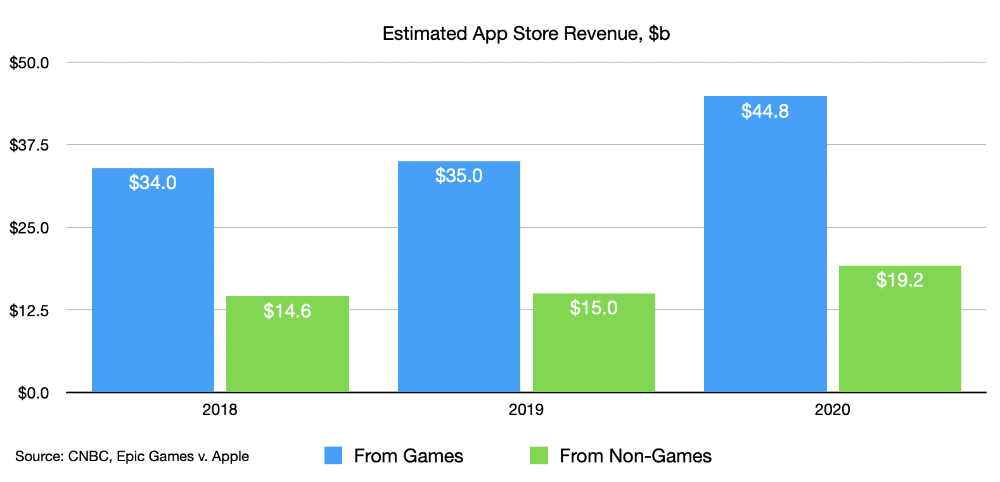

# The Missing App Economy

In the late 90s Steve Jobs was faced with a dilemma. Apple’s charismatic CEO couldn’t convince Adobe and Microsoft, makers of Photoshop and Excel, to make software for Apple’s upcoming operating system. Missing a ‘killer app’ like Photoshop on the Mac meant many people would buy a Windows PC instead. Apple conceded by investing substantial engineering effort in ‘Carbon’, a backwards-compatible software layer added to both their old and new operating systems. This stopgap gave Apple’s most important third-party developers a bridge from one system to the next, and Apple a bridge from one century to the next. 

It worked. Apple dominated the first two decades of the 21st century, reinventing computers and upending markets. Now one of the most valuable companies ever with reliable quarterly profits in the tens of billions, it appears Apple has mastered the recipe for success. However, its key ingredients of user-friendly design, tight software/hardware integration, and ground-breaking technology are today all tightly controlled or obstructed by Apple. The same recipe is out of reach to many would-be competitors and collaborators, preventing the next wave of ‘killer apps’ from thriving. 

Apple began their journey into people’s pockets twenty years ago with the iPod. The music player succeeded not only due to its striking industrial design and memorable ad campaigns with colourful dancing silhouettes, but thanks to deals with record companies Jobs had helped broker himself. He told writer Steven Levy “we walked in and we said, ‘We want to sell songs a la carte’”. The iTunes Music Store sold over one million songs in its first week. 

This success was repeated on a grander scale with the iPhone and App Store, with ten million downloads of apps in first weekend. Both were more capable versions of their predecessors: the iPhone had a larger screen and faster chips than the iPod, and apps could communicate with the internet and were far more interactive than a song. A wave of software accessible to everyday people followed — Instagram, TikTok, Uber, Airbnb — that took advantage of pocketable, always-online devices.

However, a recent court case between Apple and Epic Games found that 70% of Apple’s App Store revenue is from games. That leaves only 30% for productivity software used by businesses such as Excel and Photoshop.  Which makes reports from Apple that they have “paid out over $200bn to developers since 2008” much less compelling. According to Sensor Tower, Adobe makes an estimated $10m per month from the App Store, which is roughly 1% of its $1bn total monthly revenue. And Microsoft earns even less from the App Store, even though it makes ten-fold the revenue of Adobe. 

New productivity tools like Notion, Jira, and GitHub are all web-first: while they may offer a companion app, the primary experience is designed to be used from a web browser, like Gmail or Google Docs. Another is Figma, a design tool founded ten years ago, which made $75m in 2020 and forecasted double that for 2021. GitHub, used to collaborate on the code behind software projects, was acquired by Microsoft in 2018 for $7.5bn, and was reported at the time to be making $200m–$300m annually. Microsoft’s own Office productivity suite including Word and Excel now work in web browsers (this article was written using it), and Adobe is working on the same for its flagship apps Photoshop and Illustrator. 

The web has several key advantages over apps sold via the App Store. First, the web is an open standard that is purposefully designed to not be controlled by any single company. While makers of web browsers, such as Google’s Chrome, Microsoft’s Edge, Mozilla’s Firefox, and Apple’s Safari, are all made by large corporations with their own interests, they all must work to a single standard that they collaborate over. iPhone apps are made using Apple-provided tools that are updated every year, sometimes breaking what previously worked, which adds maintenance overhead. The first web page made in 1991 still works in the browsers of today. 

This also means developers who build using web standards aren’t locked into a particular platform. Instead of writing a particular app for iPhone and another app for Android and yet more for tablet and desktop platforms, they can be made once and adapt to whichever device a customer uses. Platform providers are incentivised to continue working with as many existing websites as possible, which puts much of the burden of maintenance and compatibility on them. And if a new device is introduced, there’s likely less work by a developer to get an existing website adapted than it takes to provide another app. 

Second, anyone can create and share a website provided they know how. Apple requires a $99 annual membership and submission to a board of reviewers before apps appear in their store. Membership can be revoked, as Epic Games found when their account was terminated in 2020, preventing them from being included in the App Store again. And reviewers are human and subject to the whims of Apple’s broader strategy. Apple Arcade is a game subscription service integrated into the iPhone, which helped contribute to the $54bn services revenue Apple made from its users in 2020. That same year Apple rejected the game streaming service xCloud. Its maker Microsoft responded “Apple stands alone as the only general purpose platform to deny consumers from cloud gaming”. xCloud is now available to iPhone users through the only alternative available: the web. 

Finally, web software can integrate with whatever payment system they prefer, whether it be PayPal, Stripe, or even cryptocurrency. Businesses can find the service that offers the lowest cost, or which makes refunding and recurring subscriptions easiest. On the App Store, Apple requires online payments be done through them, taking 15–30%. And refunds can’t be issued by a developer looking to please a dissatisfied customer, instead users must submit a request themselves via an Apple support form. 

Innovation requires trial and error, and on the iPhone app developers are prevented from properly trialling their ideas. Apple prescribes their business model: they can’t charge users an upgrade from one app version to the next, but instead must either offer new features for free or use a subscription model unpopular with many customers. Novel app ideas often never find their way on the store as their creators find themselves reading an opaque Apple rejection letter. This prevents original ideas from even being started, since Apple only accepts submissions for fully-functional apps and not early concepts, making starting new ventures as risky as betting what the weather will be in 200 days time. 

The web offers an escape hatch, but here Apple has leverage too. On the iPhone only a single implementation of the web standard is available, and that is Apple’s. Google, who primarily makes its money advertising on the web, is incentivised to make websites more like apps, and has been pushing the web standards in that direction for a number of years. Apple is incentivised to keep the web more limited than the platform-specific apps that help sell its devices. (They counterbalance this with a different approach: Google is estimated to have paid Apple $15bn in 2021 to remain the default search engine on the iPhone & iPad.) 

Steve Jobs once said “design is how it works”. If innovation is being prevented from working by the company he founded, then a new wave of design is surely being missed. 
