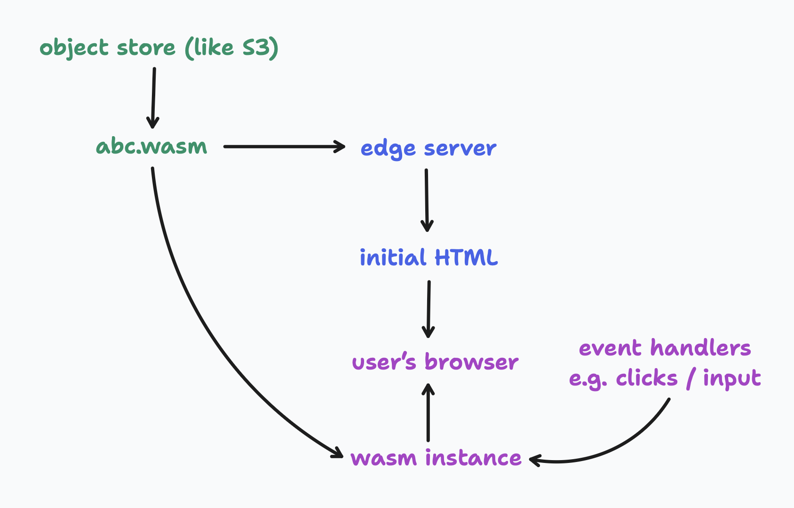

# Introducing Calculated World

[Calculated.World](https://calculated.world) is now live! Over the past few months I’ve been experimenting a lot with WebAssembly, trying to understand its limitation and its strengths. Both are pretty clear:

## Limitations

- Everything is just raw integers or floats.
- You must manage memory manually, e.g. with a bump allocator.
- Strings must be encoded and decoded to a raw sequence of bytes.
- No built-in standard library, unless you use a language like Rust, Zig, etc.

## Strengths

- Runs in the browser. (Well it is called *Web*Assembly…)
- Runs in Rust, C, C++, Golang, C#, Python, Swift, Java, Deno, Node.js, Cloudflare. This means on most servers and most devices!
- Runs consistently in all of those environments — given the same module and the same inputs, you can expect the same output, no matter the environment.
- Sandboxed, so can’t access network/disk/env/GPU.
- Can import functions and values from the outside world.
- Can be capped to a limited time quota, so an infinite loop won’t hog the system.
- Encapsulated, so consumers can only access which functions, global values, and memory has been explicitly made public by the module.

----

## The modern cloud

There’s been several key cloud services that I’ve found very influential.

AWS S3 provided one of the first truly cloud abstractions, where it’s not a file system just on the internet, but it’s a different model that can unlock better patterns, which you can treat like Mary Poppin’s infinite magic bag.

AWS Lambda demonstrated that you can upload code to an S3 bucket and then download it on-demand to a newly spun up sandboxed instance (that’s why there’s a coldstart) and have that be excellent as a model.

Vercel proved you can using content addressing to break up an application into fine grained deploys of individual Lambdas/Edges/Static Assets (that’s why their Next.js page model is such a great fit), and keep around old deploys forever since each deploy is really just a [Git Tree](https://git-scm.com/book/en/v2/Git-Internals-Git-Objects#_tree_objects) pointing at a different set of individual instances.

Cloudflare Workers showed that a more limited run time environment in terms of programming capabilities, mixed with some unique strengths such as “why manage regions when you can just deploy everywhere in the world?” and interesting new cloud primitives such as KV and Durable Objects.

Calculated.World takes those ideas and technologies and remixes them into a much simpler model — but one which unlocks capabilities I haven’t seen anywhere else.

The best way I can describe it is it’s like Lambda running WebAssembly on Edge servers all over the world. For now it’s stateless (there’s nothing persisted in the cloud), though I intend to explore that more in the future.

Pure functions downloaded quickly to anywhere able to run in any environment. Server. Edge. Browser. Native. I think that’s pretty powerful.
