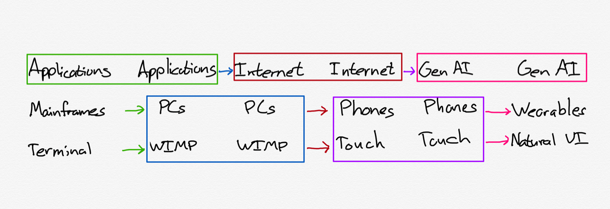

# Generative UI vs Curated UI

In the media I think there’s been much too much recency bias with Generative AI and Wearables, where since they are recently developed people assume they are the natural next step.

I have high regards for Stratechery: when he first started I think he got a lot of things right about mobile, Apple & Microsoft. Lately he’s been very bullish on wearables and AI, and has switched from analyzing the mobile revolution (which was in transition when he started writing) to forecasting wearable AI, which has yet to be proven.

Specifically [he’s positioning Generative AI and Wearables](https://stratechery.com/2024/the-gen-ai-bridge-to-the-future/) as the successor to Internet + Mobile, and I think that’s fundamentally wrong. I can imagine AI wearables being useful but I’m bearish on them becoming the primary device for quite a while.

> This, I think, is the future: the exact UI you need — and nothing more — exactly when you need it, and at no time else. This specific example was, of course, programmed deterministically, but you can imagine a future where the glasses are smart enough to generate UI on the fly based on the context of not just your request, but also your broader surroundings and state.

He is also bullish on generated user interfaces, and again I think it needs a pinch of salt. Graphical user interfaces are about curation: you decide what to put in and what should be left out.

The best analogy is going to a restaurant vs having a private chef. When you go to a restaurant the chef and staff have worked out a menu ahead of time. They have generally settled on a broad cuisine and then made specific recipes they know they can create within a quick time to many patrons, and they give them all names and put them on a list called a menu.

You don’t go to a French restaurant and ask for sushi. You don’t instruct the waiter to cook something that’s not on the menu. The menu curates via a piece of graphic design that is easy to digest visually with a particular dining experience in mind.

Now of course you can ask for alterations. But go much further than that and you begin to have a private chef who will cook anything you ask on demand. But the problem is: what to ask? You’re not a chef so you likely don’t know what will make a great meal. You might be able to come up with suggestions from what you’ve eaten before, but chances are that’s going to be pretty derivative. That’s my problem with Generative UI, either it’s taking the user’s word literally and coming up with a mediocre design, or it’s really picking from a bunch of prepared menus and making it look like it was generated.

And yes, it might be able to tailor it to your preferences, but that’s not that different to adjusting for food allergies: you are still going to need the base recipe. The AI-led tailoring becomes a convenience so the user doesn’t have to wade through a settings screen with a range of checkboxes, which is a clear but minor win. I think as a product designer you’ll still have to decide what those settings and parameters are. Otherwise the user will get vegeterian Wagyu beef and blame your brand.

> This is where you start to see the bridge: what I am describing is an application of generative AI, specifically to on-demand UI interfaces. It’s also an application that you can imagine being useful on devices that already exist. A watch application, for example, would be much more usable if, instead of trying to navigate by touch like a small iPhone, it could simply show you the exact choices you need to make at a specific moment in time.

He looks at the smart watches, but to me it’s really highlighting that Apple hasn’t done a particular great job designing and curating the Apple Watch user interface. It’s trying to stuff too much onto the wrist, like Microsoft’s strategy of putting Windows on mobile. An insanely great Apple Watch interface would be possible without using any generative AI.

If a UI is purely generative it’s not deterministic, so one person might get a totally different experience to another. So then what is your brand about if it has no consistency? To gain more uniformity you’ll have to dial the generative parts back, and then learn which bits resonate with customers and which don’t, and then you may as well freeze those parts as further polished UIs rather than generating them on-the-fly.

And generative AI is a commodity, so how does using it differentiate your experience from another company? Everyone will be able to generate the same UI controls and patterns. Brands that care are going to want to have more control, and that requires an editor’s touch to tailor it for people, who remain 100% of customers even in this AI world.

I think generative AI is more going to be useful as an accelerator for developers to build UIs, as a more intelligent search for users, and yet another tool in the existing toolbox of statistical and machine learning analysis of user behaviour. I can imagine trial balloons that show a speculative UI but I think it will be mixed in with the usual metrics and observation that product teams do today, rather than layered on top as a superior interface developer.
